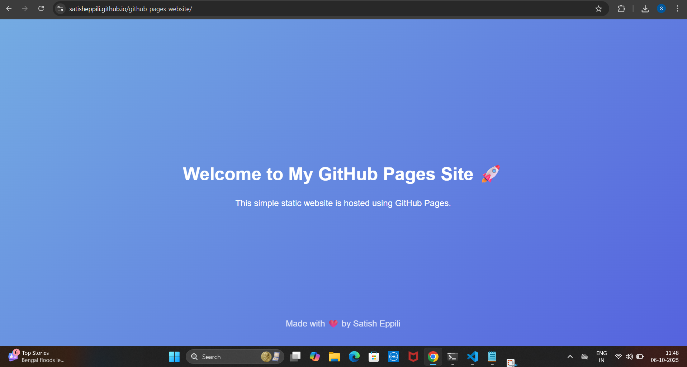

****# 🌐 Task 6: Host a Static Website with GitHub Pages

## 🎯 Objective
Deploy a simple **HTML + CSS** static website using **GitHub Pages** as part of the DevOps project tasks.

---

## 🧰 Tools Used
- **GitHub Pages** – for hosting the static website  
- **VS Code** – for creating and editing code  
- **Git** – for version control and pushing files to GitHub  
- **Web Browser** – to view the live website  

---

## ⚙️ Steps to Deploy

### 1️⃣ Create a Project Folder****
```bash
mkdir github-pages-website
cd github-pages-website
code .

#Add files

index.html → main webpage
style.css → for styling

#Initialize Git and commit

git init
git add .
git commit -m "Initial commit - add HTML and CSS"

#Push to GitHub

git branch -M main
git remote set-url origin https://ghp_RpN1dIQ2tkX6a5VE7lunOG2U0S1t@github.com/SatishEppili/github-pages-website.git
git push -u origin main

#Enable GitHub Pages

Go to Settings → Pages
Select Branch: main, Folder: / (root)
Click Save
Access your live website
https://satisheppili.github.io/github-pages-website/

📎 Deliverables

GitHub Repository: https://github.com/SatishEppili/github-pages-website

Live Website: https://satisheppili.github.io/github-pages-website/

## 💻 Example Output

